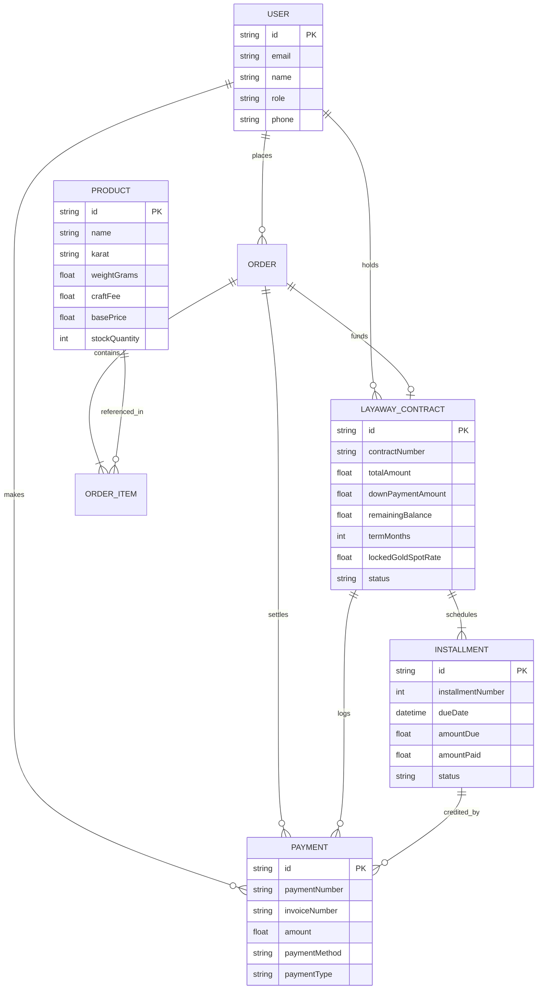

# 👑 Danica Gold — Retail Gold E-Commerce & Price-Locked Layaway Platform

A luxury full-stack gold jewelry and bullion platform built with **TypeScript**, **Next.js (App Router)**, **Tailwind CSS**, **Prisma ORM**, and **Capacitor** for native Android APK compilation.

---

## 🌟 Key Architecture & Capabilities

### 1. 💎 Customer Storefront `(shop)`
* **Live Spot Rate Ticker:** Real-time London bullion rate engine for 24K, 22K, 18K, 14K, and 10K gold with dynamic price recalculation.
* **Dynamic Gold Catalog:** Multi-factor filtering by Karat (24K–10K), Weight in grams, Category (Bullion, Necklaces, Cuban Bracelets, Solitaire Rings, Sovereign Medallions, Earrings), and Live Search.
* **Interactive Layaway Simulator:** Live installment projections on product pages allowing customers to select 20%, 30%, or 50% down payments over 3, 6, 9, or 12-month terms.
* **Persistent Shopping Cart:** State preservation with gold mass aggregation, craftsmanship fee breakdown, and seamless switching between cash & layaway.
* **Hybrid Checkout Engine:**
  * **One-Time Cash Flow:** Instant full settlement with official tax invoice generation.
  * **Layaway Contracts:** Atomically creates gold spot price-locked legal contract, downpayment authorization, and monthly installment scheduling.
* **Customer Portal (`/account`):** View active layaway contracts, track installment payment progress, pay monthly dues directly via interactive modal, view fulfillment status, and download printable official invoices.
* **Live Karat & Melt Calculator (`/calculator`):** Precision gold purity converter, scrap melt buyback estimator, and unit mass conversions (Grams, Ounces, Tolas).

### 2. 👑 Executive Admin Dashboard `(admin)`
* **Executive Analytics (`/admin`):** Real-time monitoring of collected revenue, active layaway receivables ledger, total gold grams sold, overdue accounts, and audit log of all payments.
* **Live Gold Rate Manager (`/admin/rates`):** Instant spot market price updater with automatic formula calculation and one-click catalog-wide dynamic repricing.
* **Inventory CRUD (`/admin/products`):** Create, update, delete gold listings with gram mass, craftsmanship fees, karat purity, images, and hallmark assay certification numbers.
* **Layaway Contract Management (`/admin/layaway`):** Track all customer installment schedules, monitor delinquency, and record offline/wire payments.
* **Order Dispatch (`/admin/orders`):** Update courier dispatch stages (Pending, Confirmed, Processing, Shipped, Delivered) and tracking numbers.
* **Customer CRM (`/admin/customers`):** Customer database with lifetime gold volume, active layaway counts, and contact records.

---

## 🗄️ Database Models (Prisma ORM)



---

## 🚀 Quick Start & Development

### 1. Install Dependencies & Synchronize Database
```bash
# Install packages
npm install

# Push Prisma schema to SQLite database (dev.db)
npx prisma db push

# Seed rich sample inventory, spot rates, and contracts
npx tsx prisma/seed.ts
```

### 2. Start Next.js Development Server
```bash
npm run dev
```
Open [http://localhost:3000](http://localhost:3000) to view the customer storefront or [http://localhost:3000/admin](http://localhost:3000/admin) to view the executive admin dashboard.

---

## 📱 Mobile APK Compilation via Capacitor

The application is configured with `@capacitor/core`, `@capacitor/cli`, and `@capacitor/android` with mobile-first responsive bottom navigation and dark theme styling.

### Step-by-Step Android APK Build:

```bash
# 1. Initialize Capacitor Android project (first time)
npx cap add android

# 2. Build the Next.js production web assets
npm run build

# 3. Synchronize assets to the Android native project
npx cap sync android

# 4. Open in Android Studio to build APK or run on Emulator/Device
npx cap open android
```

In Android Studio:
1. Click **Build** > **Build Bundle(s) / APK(s)** > **Build APK(s)**.
2. Your compiled native APK will be located in `android/app/build/outputs/apk/debug/app-debug.apk`.

---

## 🔒 Layaway Math & Interest-Free Price-Lock Formula

* **Down Payment:** $\text{DownPayment} = \text{TotalAmount} \times \left(\frac{\text{Percent}}{100}\right)$ (where Percent $\in \{20\%, 30\%, 50\%\}$)
* **Remaining Balance:** $\text{RemainingBalance} = \text{TotalAmount} - \text{DownPayment}$
* **Monthly Installment:** $\text{MonthlyInstallment} = \frac{\text{RemainingBalance}}{\text{TermMonths}}$ (where TermMonths $\in \{3, 6, 9, 12\}$)
* **Spot Price Guarantee:** Gold spot price per gram ($P_{\text{spot}}$) is locked atomically at contract initiation and recorded on `LayawayContract.lockedGoldSpotRate`.
